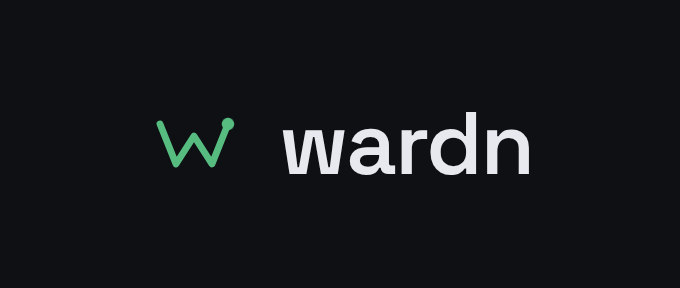

<p align="center">
  
</p>

<h3 align="center">Did that deploy make things worse?</h3>

<p align="center">
  Deploy-aware observability on top of SigNoz. wardn detects when a new version
  goes live, compares metrics, logs, and traces against the version before it,
  and tells you - automatically - whether this release regressed.
</p>

<p align="center">
  <a href="https://github.com/happymooguild/wardn"></a>
  
  
  
  
  <a href="https://www.youtube.com/watch?v=ahsQLtxf06I"></a>
  <a href="LICENSE"></a>
  
</p>

---

## Demo

<p align="center">
  <a href="https://www.youtube.com/watch?v=ahsQLtxf06I">
    
  </a>
</p>

<p align="center"><a href="https://www.youtube.com/watch?v=ahsQLtxf06I"><b>▶ Watch the 3-minute walkthrough</b></a></p>

---

## Why

Alerts fire on fixed thresholds - "p99 over 2s", "error rate over 5%". That
catches a fire; it misses a regression. A number can sit comfortably inside your
thresholds and still be worse than it was an hour ago: the old version served
checkout at 60ms, the new one serves it at 140ms, nothing is "down", and nobody
gets paged. wardn watches every deploy and answers the one question those alerts
leave open - *is this version worse than the one before it?* - and, when it is,
can explain why.

## What it does

- **Detects the deploy, whatever your pipeline is.** Everything starts with one
  call, `POST /api/v1/deployments`, carrying app, version, environment, and
  source. Direct CI sends it with a curl after a health check; GitOps sends it
  from ArgoCD Notifications on `Synced + Healthy`. wardn never needs cluster
  access and infers the previous version from history.
- **Compares version-to-version across five metrics.** When a marker lands, the
  analyzer waits for a fair window and pulls latency, error rate, throughput,
  CPU, and memory from SigNoz for the window right before and right after the
  deploy, then decides - per metric - whether the new version regressed.
- **Builds the dashboards that surface it.** A per-version dashboard for each of
  the five metrics out of the box, plus custom dashboards built from any metric
  SigNoz scrapes (discovered live). Every chart is version-labeled.
- **Alerts on the regression, not on a number.** Because wardn holds the before
  and after for each deploy, an alert can be written against the *change* -
  "tell me if p99 goes up by 5ms between versions" - over Slack or a webhook.
- **Explains regressions with AI.** *Ask AI* compares any two versions, then
  reasons over the error logs and slow/failed traces captured for that window to
  name a likely root cause and quote the evidence. Providers are pluggable:
  Anthropic (Claude), OpenAI, or Gemini.
- **Keeps its own history.** Deploys, before/after snapshots, and captured
  logs/traces live in wardn's Postgres, so comparisons outlive SigNoz retention.

## How it works

```
  CI / ArgoCD ──POST /api/v1/deployments──►  Marker API  ──►  Analyzer
   (per-app key, on healthy rollout)            │                │
                                                │                │ PromQL, before & after
                                                ▼                ▼   window, filtered by version
                                            Postgres  ◄────  SigNoz (metrics · logs · traces)
                                          (events, snapshots,      │
                                           logs/traces, analyses)  │ regression?
                                                │                  ├──► Slack / webhook alert
                                                ▼                  └──► LLM root-cause (Ask AI)
                                          Dashboard / API              Claude · OpenAI · Gemini
```

A visual version of this lives in [`docs/`](docs/) and the
[design doc](docs/design-doc.md).

## Quickstart

### Docker Compose (local)

```bash
# Optional - point the analyzer at a SigNoz instance:
export SIGNOZ_URL=https://your-signoz
export SIGNOZ_API_KEY=...

docker compose up --build
open http://localhost:8088          # log in as admin / admin@12345

# Fire a deploy marker (analysis runs after the after-window):
./demo/deploy-marker.sh v1.0.11
```

Without `SIGNOZ_*`, the marker API and the Deploys / Alerting / Dashboards UI
still work; analyzer jobs fail until SigNoz is configured.

### Kubernetes (Helm)

The production chart is [`charts/wardn`](charts/wardn) - it provisions the
backend, dashboard, and (by default) a persistent Postgres, generates its own
secrets, and templates the dashboard proxy.

```bash
helm install wardn ./charts/wardn \
  --namespace wardn --create-namespace \
  --set backend.image.repository=<registry>/wardn-backend \
  --set frontend.image.repository=<registry>/wardn-frontend \
  --set signoz.url=http://signoz.signoz.svc.cluster.local:8080 \
  --set signoz.apiKey=<minted-service-account-key> \
  --set auth.adminPassword=<a-strong-password>
```

See the [chart README](charts/wardn/README.md) for Ingress, TLS, external
Postgres, and `existingSecret` options. (The `deploy/helm/wardn` chart is a demo
skeleton for the kind / e2e scripts - use `charts/wardn` for a real install.)

## CI / ArgoCD integration

Send a marker the moment a version is confirmed healthy.

**Direct CI** - [`deploy/recipes/ci-marker.sh`](deploy/recipes/ci-marker.sh):

```bash
curl -fsS -X POST "$WARDN_URL/api/v1/deployments" \
  -H "Authorization: Bearer $WARDN_API_KEY" \
  -H 'Content-Type: application/json' \
  -d '{"app":"checkout","version":"v1.4.2","environment":"production","source":"ci"}'
```

**GitOps** - [`deploy/recipes/argocd-notifications-cm.yaml`](deploy/recipes/argocd-notifications-cm.yaml)
fires a webhook on `Succeeded + Healthy`, `oncePer` sync revision. Put the API
key in `argocd-notifications-secret` as `wardn-api-key`.

Generate a per-app key from the dashboard: **Deploys → Add app**.

## AI root cause

Open **AI Settings**, pick a provider (Anthropic, OpenAI, or Gemini), paste a
key, hit **Test**. Then open any deploy and click **Ask AI**, or compare two
versions from the **Ask AI** page.

- **Model** defaults to `claude-opus-4-8` for Anthropic; each provider has its
  own model picker (override with `AI_MODEL`).
- **Keys are write-only over the API** - `GET /api/v1/ai/provider` returns only
  the last four characters. Storing a key from the UI needs `WARDN_SECRET_KEY`
  (AES-256-GCM at rest); the Helm chart generates one automatically. Without it,
  wardn refuses to persist a key and falls back to the env variable instead.
- **Context is bounded** ([`ai/context.go`](ai/context.go)): duplicate log lines
  are collapsed with a count, then the top error logs and slowest traces from the
  after-window go in, plus a smaller baseline from before.
- **Degrades rather than fails**: if logs/traces are unreachable, the analysis
  still runs on metrics alone and the model is told the evidence was missing.
- **Auto-run on regression** is per-service and off by default (AI Settings →
  Automatic analysis).

```bash
# Env fallback works the same way SIGNOZ_API_KEY does:
export ANTHROPIC_API_KEY=sk-ant-...   # or OPENAI_API_KEY, or AI_PROVIDER=gemini + AI_API_KEY
docker compose up --build
```

## API

| Method | Path | Auth | Purpose |
|---|---|---|---|
| `GET`  | `/healthz` | - | liveness |
| `POST` | `/api/v1/auth/login` | - | session cookie |
| `POST` | `/api/v1/deployments` | API key | deploy marker |
| `POST` | `/api/v1/apps` | session | register an app, mint a key |
| `GET`  | `/api/v1/apps` / `/apps/:id/versions` | session | apps + version history |
| `GET`  | `/api/v1/deploys?app=` / `/deploys/:id` | session | deploys + before/after snapshots |
| `GET/POST/DELETE` | `/api/v1/dashboards` | session | built-in + custom dashboards |
| `GET`  | `/api/v1/signoz/metrics` | session | discover metrics for a custom dashboard |
| `POST` | `/api/v1/apps/:id/compare` | session | AI summary of two versions |
| `POST` | `/api/v1/apps/:id/root-cause` | session | AI root cause from logs + traces |
| `GET/POST` | `/api/v1/apps/:id/alerts` | session | alert configs |
| `POST` | `/api/v1/alerts/:id/test` | session | send a test notification |
| `GET/PUT/DELETE` | `/api/v1/ai/provider` | session | AI credentials (key is write-only) |
| `POST` | `/api/v1/ai/provider/test` | session | verify the configured provider |

## Configuration

| Env | Purpose |
|---|---|
| `DATABASE_URL` | Postgres connection string |
| `SIGNOZ_URL` / `SIGNOZ_API_KEY` | Analyzer queries (metrics, logs, traces) |
| `SIGNOZ_UI_URL` | Optional deep links into SigNoz |
| `PUBLIC_BASE_URL` | Base URL used in alert links |
| `ALLOW_LOCAL_WEBHOOKS` | Allow localhost webhook targets (dev default true) |
| `SEED_ADMIN_USER` / `SEED_ADMIN_PASS` | Initial admin login (`admin` / `admin@12345`) |
| `SESSION_SECRET` | Cookie-signing secret |
| `SEED_APPS` | Pre-seed services, `"name:key,name:key"` (optional) |
| `AI_PROVIDER` | `anthropic` (default) · `openai` · `gemini` |
| `AI_MODEL` | Model id; defaults to `claude-opus-4-8` for Anthropic |
| `ANTHROPIC_API_KEY` / `OPENAI_API_KEY` / `AI_API_KEY` | AI credential fallback when none is set in the UI |
| `AI_BASE_URL` | Optional proxy / compatible gateway |
| `AI_TIMEOUT` / `AI_MAX_CONTEXT_CHARS` | Per-call timeout (`120s`) and prompt ceiling (`60000`) |
| `WARDN_SECRET_KEY` | Encrypts UI-stored AI keys at rest. Unset ⇒ the UI can't save keys |

Full Helm defaults live in [`charts/wardn/values.yaml`](charts/wardn/values.yaml).

## Layout

```
main.go  api/  store/  config/    backend API, Postgres, config
metrics/  analyzer/  alert/       SigNoz client, before/after worker, notifiers
ai/  secret/                      LLM providers + prompt bounding, credential encryption
frontend/                         Dashboards · Deploys · Alerting · Ask AI · AI Settings
charts/wardn/                     production Helm chart
deploy/helm/  deploy/kind/  deploy/e2e/   demo skeleton + kind + end-to-end
deploy/recipes/                   CI curl + ArgoCD Notifications
demo/sample-app/                  metric/log/trace emitter for the demo
docs/                             design doc, AI-layer design, blog
```

## License

[MIT](LICENSE) © Shubham Singh
