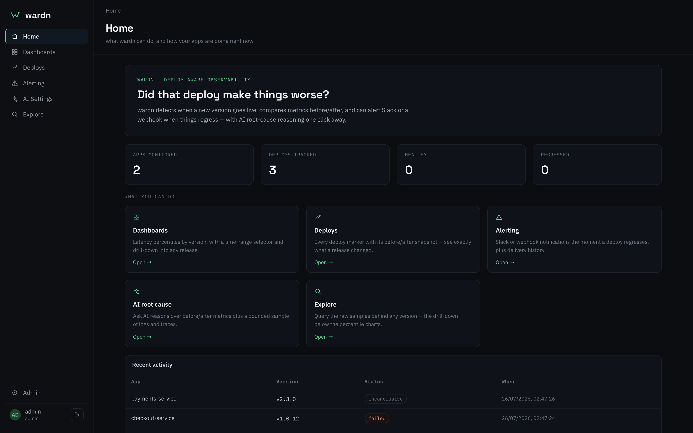
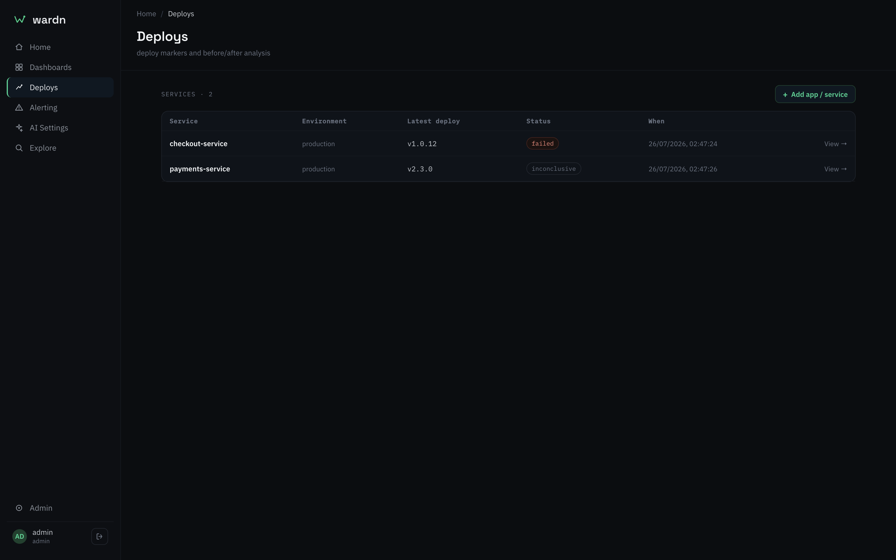
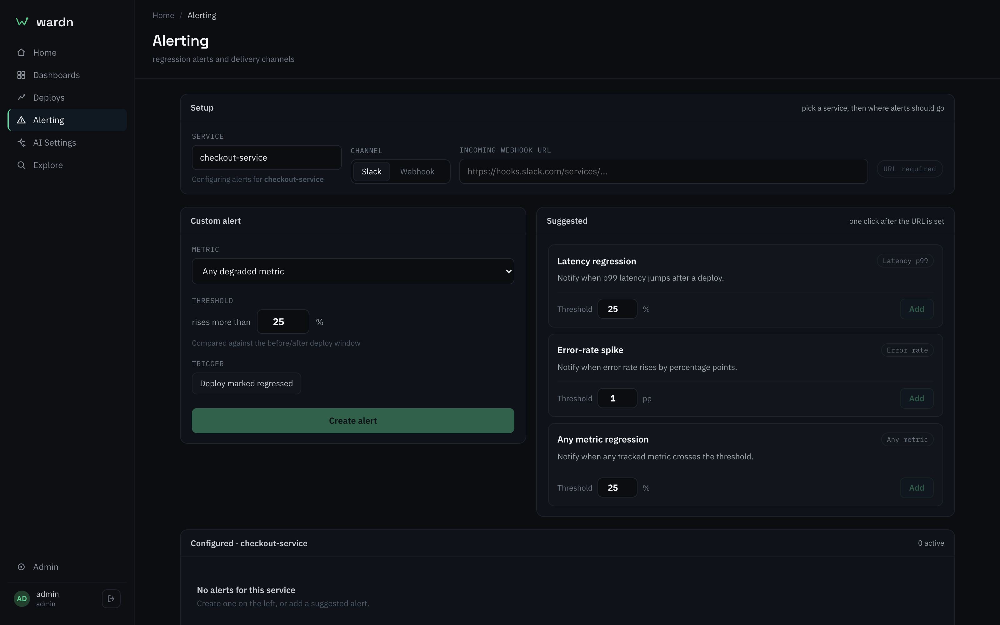
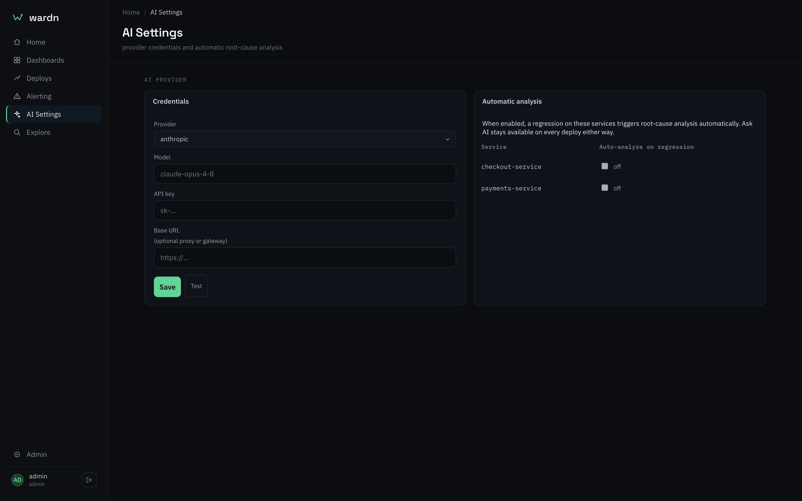
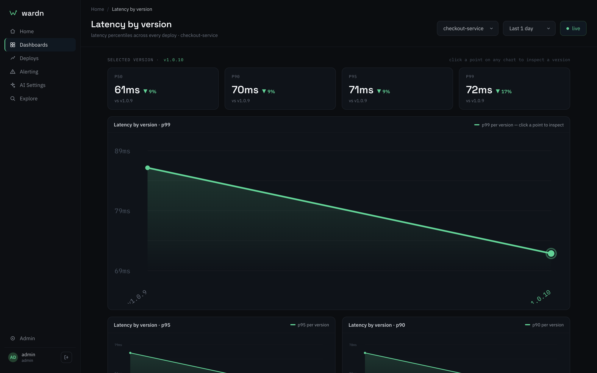
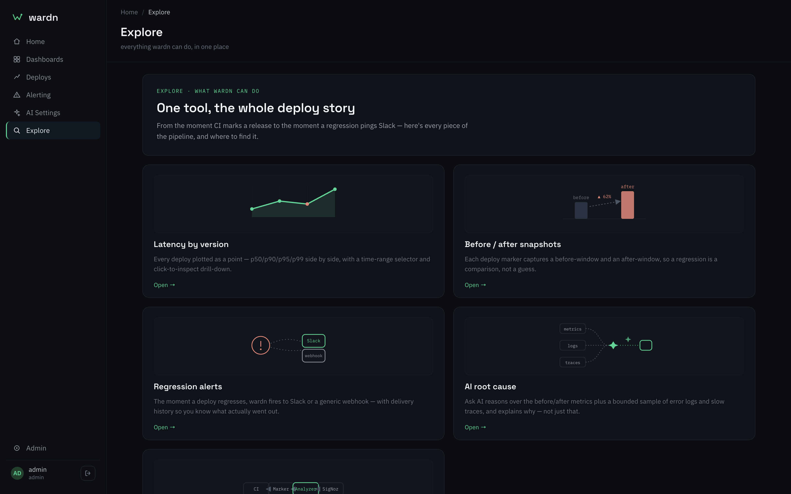
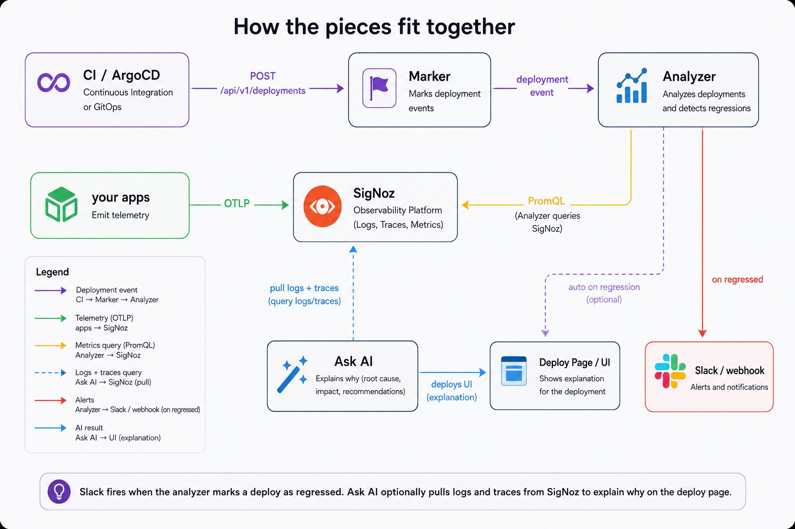

# wardn: deploy-aware observability on top of SigNoz

wardn is a small tool we built to answer one question after every release: **did this deploy make things worse?**

That sounds simple. In practice most teams still figure it out the hard way — a customer tickets it, someone notices a chart looking off, or an alert finally trips hours later when the damage has already spread. Absolute alerts ("p99 above 2 seconds", "error rate above 5%") are good at catching fires. They're bad at catching a quiet regression: the new version is 15% slower, or errors crawled from 0.8% to 1.4%, and nothing is "broken" by the alert book yet. Customers already feel it. On-call doesn't.

wardn sits next to your existing observability. It doesn't replace SigNoz. It uses SigNoz for metrics, logs, and traces, and adds the missing piece: **a deploy moment, plus a before/after comparison tied to that moment.**



---

## The problem we were solving

When you ship a new version of a service, you usually know *that* it went out. You rarely get an automatic, honest answer to *how it compares* to the version that was live five minutes ago.

So people do one of these:

- Stare at dashboards and try to eyeball a dip around "somewhere near the deploy."
- Wait for a page that may never come if you're under the threshold.
- Find out from users.

We wanted something automatic and deploy-shaped: mark the healthy rollout, wait for a fair window of traffic, compare the metrics that matter, show the result clearly, ping the team if it regressed, and — if you want — dig into *why* using the same logs and traces you already collect in SigNoz.

That's what wardn does end to end.

---

## What wardn can do

### 1. Deploy markers (CI or ArgoCD)

Everything starts with a single call: `POST /api/v1/deployments`. You send the app name, version, environment, and timestamp. wardn stores the event, figures out the previous version from history, and queues analysis.

**Why this matters:** without a trusted "this version is live and healthy now" signal, any before/after chart is guesswork. We don't scrape Git or invent deploy times from image tags. The pipeline that knows the rollout succeeded tells us.

- **Direct CI:** after your health check passes, a small script (`ci-marker.sh`) curls wardn.
- **GitOps / ArgoCD:** ArgoCD Notifications fires a webhook when the app is synced and healthy. We use `oncePer` sync revision so flapping health doesn't create duplicate markers.

You keep deploying the way you already deploy. wardn only needs that one confirmation.

A real marker call against a running cluster:

```console
$ curl -X POST http://localhost:8088/api/v1/deployments \
    -H 'Content-Type: application/json' \
    -H 'Authorization: Bearer $WARDN_API_KEY' \
    -d '{"app":"checkout-service","version":"v1.0.13","source":"ci"}'

HTTP 201
{
  "id": 4,
  "app": "checkout-service",
  "version": "v1.0.13",
  "previous_version": "v1.0.12",
  "environment": "production",
  "source": "ci",
  "deployed_at": "2026-07-25T21:43:48Z",
  "status": "pending_analysis",
  "analysis_scheduled_at": "2026-07-25T21:44:18Z"
}
```

Note what comes back: wardn resolved `previous_version` itself, and told you exactly when it will judge the release. The GitOps equivalent, from `deploy/recipes/argocd-notifications-cm.yaml`:

```yaml
# oncePer avoids duplicate markers when health flaps Progressing → Healthy.
trigger.on-deployed: |
  - when: app.status.operationState.phase in ['Succeeded'] and app.status.health.status == 'Healthy'
    oncePer: app.status.sync.revision
```

---

### 2. Automatic before/after analysis

After a marker, the analyzer waits until the **after** window is as long as the **before** window (configurable per service, often around two minutes for demos). Then it queries SigNoz with PromQL for each enabled metric — latency, error rate, and whatever else you define in metric templates — and writes snapshots: before value, after value, delta, verdict.

Verdicts are straightforward:

| Verdict | Meaning |
|---|---|
| `healthy` | no regression past your thresholds |
| `regressed` | something got worse enough to care |
| `inconclusive` | not enough data to judge (empty series isn't treated as "fine") |
| `failed` | the query or job itself broke |

**Why this design:** comparing unequal windows lies. If you judge too early, the after side is thin and everything looks like a regression. Waiting for equal windows is slower for a demo, but it's the honest way to judge a release. Empty data becomes `inconclusive` on purpose — "we couldn't see" is more useful than a fake green check.

We also treat thresholds carefully. Latency uses a **relative % change**. Error rate uses **percentage points** (absolute delta). A relative jump on a tiny error baseline is mostly noise; mixing units without labeling them misleads people. Suggested alerts in the UI follow the same rules.

---

### 3. Deploys page

This is where you live after a release. You get a list of deploys per service, status, and detail with before/after snapshot cards for each metric. You can see, in one place, what changed for this version — not a wall of charts you have to align by hand to a deploy time.

**Why it matters:** the comparison *is* the product. If the answer is buried in a generic dashboard, people won't use it under pressure. The Deploys view is built around the deploy event as the primary object.



---

### 4. Alerting (Slack + webhook)

If analysis lands on `regressed` and you've configured a channel, wardn notifies Slack or a generic webhook and keeps a delivery history. In the UI you pick a service (searchable — service lists grow), set a shared channel, add custom thresholds, or one-click suggested alerts.

**Why this matters:** the point of detecting a quiet regression is to tell someone before customers do. Absolute platform alerts still help for outages; these alerts are specifically "this deploy made metric X worse." They fire on the analyzer verdict, not on a reinvented query language. That keeps the mental model honest: configure *when and where* to notify, not a pretend LogQL builder for something that isn't evaluating logs.

There's a **Test** path so you can verify Slack without waiting for a bad deploy.



Note the units are explicit in the UI: the latency card is a **%** threshold, the error-rate card is **pp**.

---

### 5. Ask AI (root cause on demand)

When something looks wrong — or when you just want a second opinion — open a deploy and hit **Ask AI**. wardn pulls the before/after metrics plus a bounded sample of SigNoz error logs and slow traces around the windows, sends that to Claude or OpenAI (your choice in AI Settings), and returns a structured explanation you can read next to the snapshots.

You can also turn on **auto-run on regression** per service if you want analysis without clicking. Keys can live in the UI (encrypted at rest when `WARDN_SECRET_KEY` is set) or via env, same idea as SigNoz credentials.

**Why this matters:** a delta says *what* got worse. On-call still has to open logs and traces and hunt. Ask AI doesn't replace that judgment, but it shortens the first pass: "here are the fingerprints that showed up after this version." We deliberately cap and dedupe evidence so you don't dump a full window into the model — cost stays predictable, and the answer stays focused. If logs/traces aren't reachable, analysis still runs on metrics alone and **says evidence was missing** instead of failing hard.



The API key is write-only: the server only ever returns its last four characters, so this page can show *which* key is installed without handing it back.

---

### 6. Latency-by-version dashboard

Alongside the SigNoz-backed analyzer loop, wardn still has a simple dashboard fed by sample metrics (and our demo app): latency by version, time-range picker, percentiles, drill-down. It's useful for demos and for seeing version labels on a chart over longer ranges.

**Why it matters:** before/after snapshots answer "this release." Version charts answer "how have we been trending across releases?" Both views help; they answer different questions.



---

### 7. Sample app + recipes

We ship a sample service that can post metrics to wardn and optionally export OTLP gauges into SigNoz, plus scripts to fire a demo marker. CI and ArgoCD recipes live under `deploy/recipes/`. The point isn't the sample app itself — it's so a team can see the full loop without wiring production first.

If you're new to the tool, the in-app **Explore** page walks the same ground:



---

## How the pieces fit together



SigNoz stays the system of record for time series and telemetry. wardn stores deploy events, job state, sparse snapshots, alert config, and delivery history in Postgres. We don't try to duplicate your metrics backend. We ask SigNoz sharp questions at deploy time.

That split is intentional:

| Concern | Who owns it |
|---|---|
| "A healthy deploy happened" | wardn marker (CI / ArgoCD) |
| "What did latency / errors do?" | SigNoz metrics via PromQL |
| "What do logs/traces say around then?" | SigNoz + Ask AI |
| "Tell the team" | wardn alerts |
| "Show me the deploy story" | wardn UI |

If we had tried to invent deploy annotations inside the metrics tool, or to pull deploy times from CI alone without a healthy signal, we'd either fight the backend or mark deploys that never actually served traffic. Owning the marker and borrowing the telemetry keeps each side doing what it's good at.

### One thing we store, and why

wardn keeps a **sparse snapshot** of each deploy's before/after numbers in Postgres rather than re-querying SigNoz every time someone opens a deploy. That's not a cache — it's a receipt.

The snapshot records the exact windows, the values, the delta, the verdict, *and the rendered PromQL that produced them*. That matters because every input to that query is an editable row: the metric template, the service name, the window length, the thresholds. Swap the demo PromQL for real APM queries — the documented production step — and a re-query would silently re-answer every historical deploy with a new question. Add the ordinary time-series behaviours (late-arriving samples, retention rollups) and the same window can return different numbers days later.

Since the verdict has already set a status, fired a Slack message, and maybe prompted a rollback, an Ask AI explanation reasoning over *fresh* numbers wouldn't be a second opinion — it would contradict the artifact that paged someone, with no way to tell which is right. Pinning the snapshot keeps the alert and the explanation provably about the same observation.

---

## Why this helps in real life

Imagine you ship `checkout-service` at 14:02. By 14:05 wardn has equal windows, queries SigNoz, and shows latency up 28% with error rate flat. Slack gets a message. Someone opens the deploy, hits Ask AI, and sees error logs clustering around a new dependency timeout that only shows under post-deploy traffic. You roll back or hotfix while the absolute alert thresholds are still green.

That's the everyday win: faster, quieter regressions become visible and attributable to a version, without asking every engineer to manually align dashboards to deploy times every release.

It also helps people who aren't full-time on-call. Product and eng leads can open **Deploys** and see "last three releases: healthy, healthy, regressed on latency" without learning every PromQL template. The templates and thresholds are still yours to tune for production metric names — the demo uses simple OTLP gauges; real services swap in real histograms and error rates.

---

## What we'd still be careful about

wardn is as good as the marker and the data. If CI marks before the app is actually healthy, you'll compare against the wrong baseline. If SigNoz has no series for that service in the window, you'll get `inconclusive` — which is correct, but means you need instrumentation and labeling (`service.name` aligned with wardn's service name) sorted out first. AI explanations are helpers, not truth; always check the cited logs and traces.

One asymmetry worth knowing: metrics are pinned into the snapshot, but **logs and traces are not** — they're fetched live from SigNoz when you click Ask AI. Ask about a week-old deploy and you'll get accurate numbers alongside a log window that may have aged out. The prompt tells the model when evidence is missing rather than letting it read absence as health, and the quoted lines are frozen into the analysis once it runs — but the first analysis of an old deploy is evidence-poor by construction.

We're not claiming auto-rollback or a full multi-backend story in the demo. SigNoz is first-class for metrics/logs/traces here; the metrics provider is shaped so other backends can be added later without rewriting the product idea.

---

## Closing

wardn is deploy-aware observability: mark the healthy release, compare what SigNoz already knows before and after, alert when it got worse, and optionally ask why with logs and traces. We built it because absolute alerts and generic dashboards don't answer "did this version hurt us?" — and that question is what teams actually ask every time they ship.

**Repo:** [github.com/happymooguild/wardn](https://github.com/happymooguild/wardn) · **SigNoz:** [signoz.io/docs](https://signoz.io/docs)

---

## Try it yourself

Every screenshot in this post came from a local kind cluster. One command brings up the whole thing — cluster, images, Postgres, the dashboard, and two demo services already emitting metrics:

```bash
./deploy/kind/setup.sh          # cluster + images + helm install
open http://localhost:8088      # login: admin / admin@12345
```

That gets you the marker API, the Deploys and Alerting UI, and the latency-by-version dashboard. To light up the full loop — real before/after analysis and Ask AI — point it at SigNoz and give it a model key:

```bash
helm upgrade wardn ./deploy/helm/wardn --reuse-values \
  --set backend.signozUrl=https://your-signoz \
  --set backend.signozApiKey=... \
  --set backend.aiApiKey=sk-ant-... \
  --set backend.secretKey=$(openssl rand -hex 32)

# env comes from a Secret, so a value-only change needs an explicit roll
kubectl rollout restart deploy/wardn-backend
```

Then simulate a bad release and watch the loop run:

```bash
./deploy/kind/regress.sh on     # sample app starts serving slower
./demo/deploy-marker.sh v1.0.14 # mark it, then wait one window
```

Within a window the deploy flips to `regressed`, the snapshot cards fill in, Slack fires if you configured it, and **Ask AI** will explain the delta using the logs and traces SigNoz already collected.

Tear it down with `./deploy/kind/teardown.sh`.
