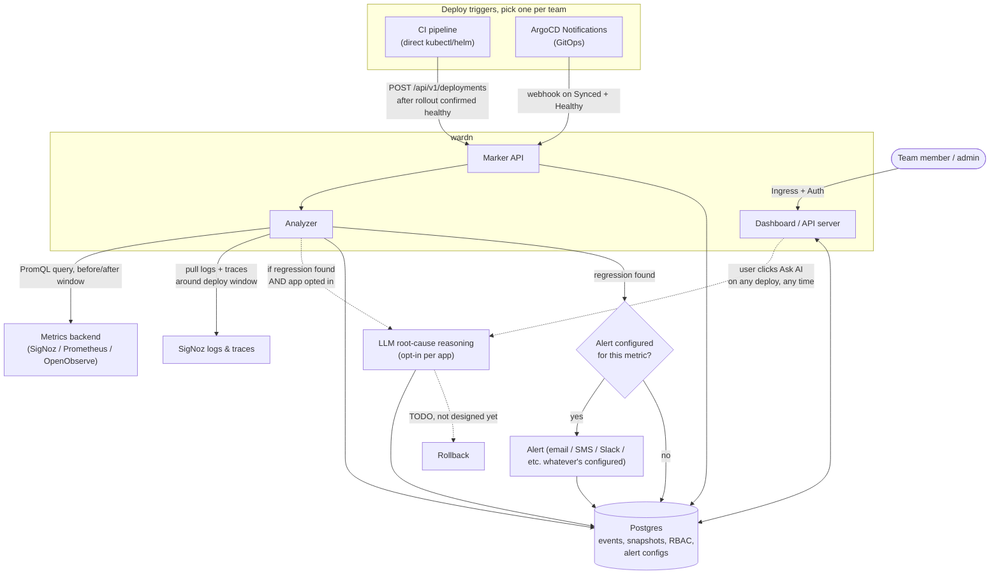

# High Level Design Doc

## 1. Problem Statement

Right now, when a team deploys a new version of a service, there is no automatic answer to "did this deploy make things worse?" Teams find out one of two ways:

- A customer complains.
- Someone happens to be looking at a dashboard at the right moment.

Alerts don't close this gap. They're built to catch things that are already broken or about to break - p99 above 2 seconds, error rate above 5%. They're not built to catch a version quietly making things 10ms slower, or error rate creeping up 1%. Nothing is wrong yet, by the alert's definition, so nothing fires - but your customers are already having a worse experience than they were an hour ago.

That's the actual gap: no tool tells you how your app is performing on this version compared to the last one, across the metrics that matter, so you don't have to guess at customer experience - you just have to wait for it to get bad enough to trip a threshold, or bad enough for someone to complain.

## 2. Goals

- Detect, automatically, the moment a new version of a service is live and healthy - regardless of how the team deploys (raw CI, or GitOps via ArgoCD/Flux).

- Automatically compare metrics from immediately before and immediately after that moment. Build a dashboard with graphs purpose-built for this comparison - before/after for each tracked metric. And then there should be an option to plot all the recorded versions on a graph, so multiple graphs each showing one metric, each point clearly labeled.

- If a real regression is found, have an option to explain *why* using an AI layer reasoning over logs and traces, not just report the delta.

- Add an option to Alert the team, provide various alerting integrations like slack, custom webhook, email (We can add more later). **Rollback (auto or manual) is TODO - see §9 for why this isn't settled yet, and needs a follow-up discussion before design.**

- Work across observability backends (SigNoz first, Prometheus/OpenObserve as extensions) since not every team uses the same stack.

## 3. Goals for later

- Full SSO/OIDC (interface designed for it, not wired up for the demo).
- Multi-backend metrics in the actual demo (SigNoz only; abstraction designed to extend).
- Cross-backend logs/traces (SigNoz only, no near-term plan to change this).

## 4. High-level architecture



## 5. Detection - the marker API

The single source of truth for "a deploy happened" is one endpoint:

```
POST /api/v1/deployments
Authorization: Bearer <per-app API key>
Content-Type: application/json

{
  "app": "checkout-service",
  "version": "a1b2c3d",
  "environment": "production",
  "timestamp": "2026-07-19T10:15:00Z"
}
```

`previous_version` is **not** sent by the caller - wardn infers it from the last recorded marker for that `app` in Postgres. This keeps the payload small and removes a fiddly bit of logic every caller would otherwise have to duplicate.

wardn does not care who calls this endpoint or how they deploy. It only cares that the caller can vouch for "this version is confirmed live and healthy right now." Two concrete callers, because "confirmed healthy" means something different depending on the deploy model:

### 5a. Direct CI (kubectl / helm, no GitOps)

CI already has cluster credentials and already runs the deploy. The only new step is a curl call at the very end, gated behind a blocking health check that the app was successfully deployed.

### 5b. GitOps (ArgoCD)

CI's job ends when it commits a new image tag to a manifest repo. CI never sees the actual rollout - ArgoCD does, asynchronously. So ArgoCD's own Notifications controller is the caller, not CI. This is a config recipe (a `ConfigMap`), not custom code:

Sketch of the ArgoCD Notifications config (verify exact field names against current ArgoCD docs before shipping):

```yaml
apiVersion: v1
kind: ConfigMap
metadata:
  name: argocd-notifications-cm
data:
  service.webhook.wardn: |
    url: https://wardn.yourcompany.com/api/v1/deployments
    headers:
    - name: Authorization
      value: Bearer $wardn-api-key

  template.app-deployed: |
    webhook:
      wardn:
        method: POST
        body: |
          {
            "app": "{{.app.metadata.name}}",
            "version": "{{.app.status.sync.revision}}",
            "environment": "production",
            "timestamp": "{{.app.status.operationState.finishedAt}}"
          }

  trigger.on-deployed: |
    - when: app.status.operationState.phase in ['Succeeded'] and app.status.health.status == 'Healthy'
      send: [app-deployed]

  subscriptions: |
    - recipients: [webhook:wardn]
      triggers: [on-deployed]
```

Flux would follow the same pattern via its `notification-controller` (Alerts + Providers), same target endpoint.

### 5c. API key provisioning and scoping

- **Issuance**: an admin registers an app in the wardn dashboard, which generates a key shown once, bound to that specific `app` (and environment) at creation. The admin places it wherever the caller needs it - a CI secret for direct-CI pipelines, or a Kubernetes `Secret` (e.g. `argocd-notifications-secret`) for the ArgoCD path, referenced from the notifications `ConfigMap`.
- **This is normal secret exposure, not a new risk.** For the ArgoCD case the key does live in the cluster as a `Secret` object - same trust model as every other credential ArgoCD already holds (registry pulls, git creds), governed by the same Kubernetes RBAC on Secrets.
- A key being valid isn't enough - it must be valid *for the specific app in the payload*. Each key is bound to exactly one `app` at issuance; on every request, the Marker API checks that the authenticated key's bound app matches the `app` field in the body. Mismatch -> `403`. Without this check, a leaked or misused key from one team could post markers claiming to be a completely different app, polluting that app's regression history or triggering false alerts on a service it has no business touching.

### 5d. Robustness the Marker API needs, given two different callers

- **Auth**: per-app API key, checked on every request, and scoped - not just "is this key valid" but "is this key valid for this app."
- **Idempotency**: ArgoCD notifications can retry on webhook failure - dedupe on `(app, version, timestamp)` so a retry doesn't create a duplicate deploy event.
- **Validation**: reject malformed/missing fields with a clear 4xx rather than silently dropping them - a misconfigured notification template should fail loud.
- **Clock skew tolerance**: don't trust the caller's `timestamp` blindly for extreme values; sanity-check against server-received time.


## 6. Storage - Postgres only

**One store: Postgres.** wardn stores config, relational data, *and* deploy telemetry -
there is no separate analytics database. The metrics backend (SigNoz) already holds the
raw time series; wardn only keeps sparse before/after **snapshots** and small metadata,
which is low-volume and relational. A second engine (ClickHouse) would be pure operational
overhead for no benefit at this scale, so it's out.

| Table | Purpose |
|---|---|
| `apps` | Registered apps: name, environment, hashed API key |
| `users`, `roles` | Auth and RBAC |
| `permissions` | Per-user capability grants (e.g. can edit dashboards / can edit alerts) |
| `dashboard_configs` | Per-user/team custom dashboards, built from the metric library |
| `alert_configs` | Per (app, metric, channel): whether an alert is configured, and where it goes |
| `metric_definitions` | Admin-managed library of named PromQL query templates |
| `deploy_events` | One row per marker received: app, version, previous_version, environment, timestamp, source (ci/argocd) |
| `metric_snapshots` | Before/after query results per deploy event |
| `analyses` | LLM prompt + response per regression found, linked to a deploy event (automatic or on-demand) |

Deploy history is queried "give me this app's deploys in time order," so a simple index on
`(app, deployed_at)` covers it - no partitioning or specialised engine needed at demo scale.

```sql
CREATE TABLE deploy_events (
    id               BIGSERIAL PRIMARY KEY,
    app              TEXT        NOT NULL,
    version          TEXT        NOT NULL,
    previous_version TEXT,
    environment      TEXT        NOT NULL,
    deployed_at      TIMESTAMPTZ NOT NULL,
    source           TEXT        NOT NULL CHECK (source IN ('ci', 'argocd')),
    inserted_at      TIMESTAMPTZ NOT NULL DEFAULT now(),
    UNIQUE (app, version, deployed_at)          -- idempotency: retries don't duplicate
);
CREATE INDEX ON deploy_events (app, deployed_at DESC);
```

`metric_snapshots` and `analyses` are plain Postgres tables too, snapshot payloads held in
`JSONB`. If deploy volume ever outgrows a single Postgres (not a demo concern), revisit a
dedicated telemetry store then - see `todo.md`.

## 7. Metrics abstraction

```go
type MetricsProvider interface {
    Query(ctx context.Context, promql string, start, end time.Time) (Series, error)
}
```

One PromQL-over-HTTP implementation, pointed at whichever backend the app config specifies. **Assumption to verify before building on it**: confirm SigNoz's query API is genuinely PromQL-compatible the same way Prometheus and OpenObserve are - don't assume, check, the same way the SigNoz annotation feature turned out not to exist.

## 8. AI reasoning

Triggered when the before/after metric diff crosses a configured threshold and then the user opts for it - not on every deploy. Given the before/after metrics, logs, and traces for the same windows, the model is asked to point at a likely cause. Scoped to SigNoz-sourced logs/traces only for now.

## 9. Rollback - TODO (deferred), direction decided

Deferred past the initial build, but the approach is now settled: **wardn is an
action-taker.** When an alert flagged for auto-rollback fires, wardn performs a
`kubectl rollout undo` on the affected Deployment, reverting it to the previous
revision. A manual "roll back" button in the UI is the first cut; the auto path
layers the same action onto an alert.

This means wardn holds **scoped cluster access**: a ServiceAccount + Role/RoleBinding
granting rollback rights (`get`/`patch` on the relevant Deployments, plus the
`deployments/rollback`-equivalent) in the namespaces it manages. Access is the minimum
needed to undo a rollout - not broad cluster admin.

Enablement is explicit and per-app:

- The team creates the ServiceAccount + Role/RoleBinding that gives wardn rollback access.
- Only then does the per-alert **auto-rollback** checkbox become selectable; until the
  RBAC is in place it stays greyed out ("no rollback method configured for this app").

Guardrails (detailed in `todo.md`): a circuit-breaker so wardn never rolls the same app
back twice in a short window (avoids flapping between versions), a sustained-regression
confidence gate, a dry-run / notify-only mode, an audit-log + alert on every rollback,
and a heavier capability grant to enable it than to merely edit alerts.

**Known limitation to revisit:** for GitOps teams, a live `rollout undo` fights ArgoCD's
self-heal (Git remains the source of truth and will re-sync the bad version). The
action-taker model is correct for direct-CI/kubectl teams; the GitOps story needs its
own follow-up before it's shipped to those users.

## 10. Auth & RBAC

- Ingress-fronted dashboard.
- Auth: GitHub OAuth or basic email/password; interface designed so OIDC (Keycloak/Okta/Google) is a swap-in later, not a rewrite.
- Roles: `admin` (manage users, define metric sources, org-wide dashboards), `member` (view + build personal dashboards from the metric library).

## 11. Deployment topology

One Helm chart, two components:

- **App**: stateless, 1–2 replicas for the demo (state lives in Postgres, so this scales horizontally later with zero code change).
- **Postgres**: managed instance for the hackathon to save setup time, or a StatefulSet if going fully self-contained.

Plus: Ingress in front of the Dashboard, and wardn emits its own OTel traces/logs into SigNoz - the tool watching deploys is itself observable in the same stack.

## 12. Hackathon MVP cut

- One metrics backend (SigNoz), not the full abstraction.
- Two metrics: latency p99, error rate.
- Simple percentage-delta threshold, not statistical modeling.
- Basic auth or GitHub OAuth, not SSO.
- Slack alert as a stretch goal if time remains.
- Self-observability kept in scope - cheap to add, good demo beat.

## 13. Open questions

1. Verify SigNoz's PromQL query-API compatibility before building the metrics abstraction on that assumption.
2. Pick the OIDC library for the auth interface (`goth`, `zitadel/oidc`, or hand-rolled) so the interface shape is right even before a real provider is wired up.
3. Confirm per-app API key is sufficient auth for the Marker API, or whether something heavier is warranted for production use.
4. Verify exact ArgoCD Notifications field names/syntax against current docs before shipping the adapter config as a public recipe.
5. **Rollback design - needs its own dedicated discussion.** See §9. Not scoped for the hackathon MVP until this is resolved.