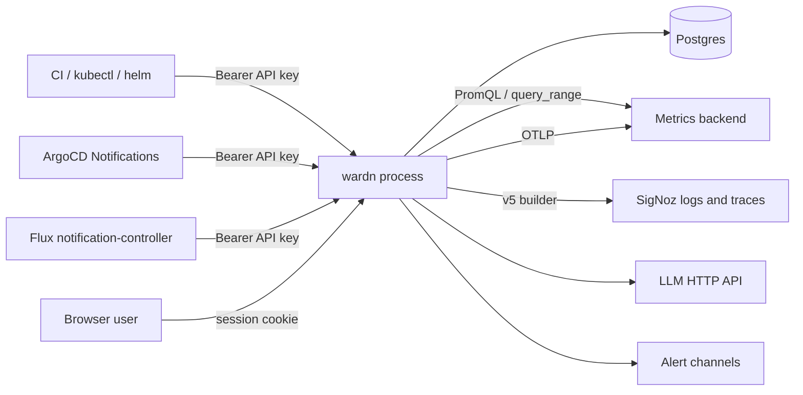
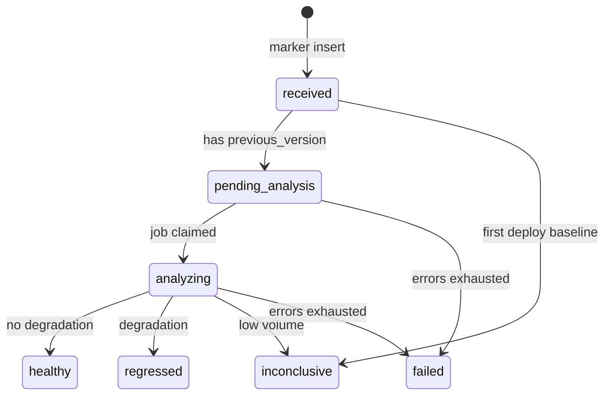
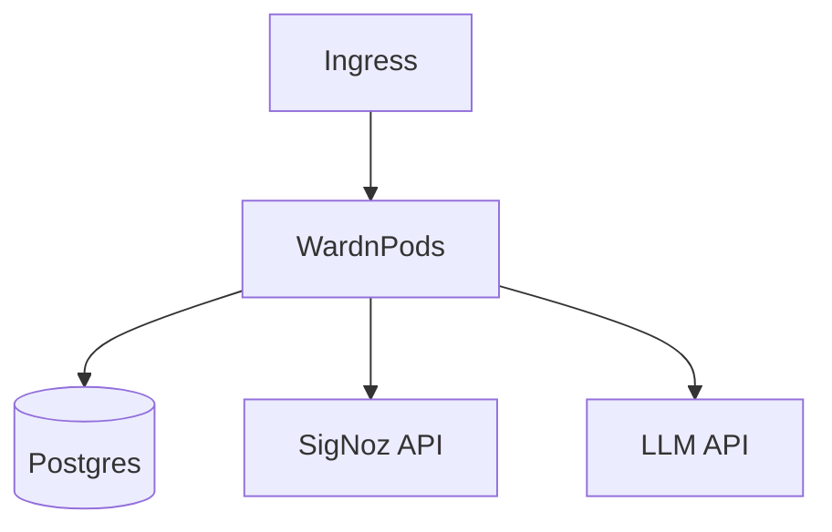

# wardn - Low-Level Design

Companion to the HLD in [our-code/wardn/docs/design-doc.md](our-code/wardn/docs/design-doc.md). This document specifies **how each component works internally**: interfaces, algorithms, storage, APIs, and external integrations.

**Scope boundary:** wardn never has direct cluster access. Rollback is out of this design. Deploy markers are owned by wardn (SigNoz has no deploy-marker API).

---

## 1. System context



**Process model:** one Go binary exposes HTTP (Marker + Dashboard API + static UI) and runs an in-process **Analyzer worker** that consumes analysis jobs. Horizontal scale: N replicas share Postgres; jobs are claimed with `FOR UPDATE SKIP LOCKED` so only one replica processes a given deploy.

---

## 2. Component map

| Component | Package (proposed) | Responsibility |
|-----------|-------------------|----------------|
| **Config** | `internal/config` | Env/file config; validated at boot |
| **HTTP server** | `internal/api` | Routing, middleware, request/response codecs |
| **Marker** | `internal/marker` | Ingest deploy events |
| **App registry** | `internal/apps` | CRUD apps, API key lifecycle |
| **Analyzer** | `internal/analyzer` | Windowing, compare, verdict, enqueue AI/alerts |
| **MetricsProvider** | `internal/metrics` | Backend-agnostic PromQL query |
| **SigNoz client** | `internal/signoz` | HTTP to SigNoz v5 + helpers |
| **Telemetry (logs/traces)** | `internal/telemetry` | Fetch evidence for AI (SigNoz-only) |
| **AI** | `internal/ai` | Prompt build, LLM call, structured parse |
| **Alerts** | `internal/alert` | Channel adapters, fire on regression |
| **Auth** | `internal/auth` | Sessions, OAuth, password, RBAC |
| **Store** | `internal/store` | Postgres repositories + migrations |
| **Job queue** | `internal/jobs` | Durable analysis jobs over Postgres |
| **OTel** | `internal/otel` | Self-instrumentation of wardn |
| **Web UI** | `web/` | React dashboard |

---

## 3. Storage design

### 3.1 Decision

**Postgres is the system of record for config and deploy telemetry** (events, snapshots, analyses). ClickHouse is a **future** optimization for high-volume append-only history; not required for correct behavior. Snapshots store both scalar values and downsampled series JSON for charts.

### 3.2 Relational schema

```sql
-- Enum-like checks enforced in app + CHECK constraints

CREATE TABLE users (
  id              UUID PRIMARY KEY,
  email           TEXT NOT NULL UNIQUE,
  name            TEXT NOT NULL,
  password_hash   TEXT,                  -- null if GitHub-only
  github_id       TEXT UNIQUE,
  role            TEXT NOT NULL CHECK (role IN ('admin','member')),
  created_at      TIMESTAMPTZ NOT NULL DEFAULT now(),
  updated_at      TIMESTAMPTZ NOT NULL DEFAULT now()
);

CREATE TABLE sessions (
  id              UUID PRIMARY KEY,
  user_id         UUID NOT NULL REFERENCES users(id) ON DELETE CASCADE,
  token_hash      BYTEA NOT NULL UNIQUE,
  expires_at      TIMESTAMPTZ NOT NULL,
  created_at      TIMESTAMPTZ NOT NULL DEFAULT now()
);

CREATE TABLE apps (
  id                    UUID PRIMARY KEY,
  name                  TEXT NOT NULL,           -- marker "app" field
  environment           TEXT NOT NULL,
  display_name          TEXT NOT NULL,
  signoz_service_name   TEXT NOT NULL,           -- filter in queries
  api_key_prefix        TEXT NOT NULL,           -- first 8 chars for UI
  api_key_hash          BYTEA NOT NULL,          -- argon2id/bcrypt of full key
  metrics_backend       JSONB NOT NULL,          -- see §5.3
  window_seconds        INT NOT NULL DEFAULT 600,
  analysis_delay_seconds INT NOT NULL DEFAULT 60,
  latency_threshold_pct DOUBLE PRECISION NOT NULL DEFAULT 25,
  error_rate_threshold_pp DOUBLE PRECISION NOT NULL DEFAULT 1.0,
  min_requests          INT NOT NULL DEFAULT 50,
  ai_enabled            BOOLEAN NOT NULL DEFAULT false,
  auto_ai_on_regression BOOLEAN NOT NULL DEFAULT false,
  created_at            TIMESTAMPTZ NOT NULL DEFAULT now(),
  updated_at            TIMESTAMPTZ NOT NULL DEFAULT now(),
  UNIQUE (name, environment)
);

CREATE TABLE metric_definitions (
  id              UUID PRIMARY KEY,
  key             TEXT NOT NULL UNIQUE,  -- latency_p99, error_rate
  name            TEXT NOT NULL,
  description     TEXT,
  -- Template with placeholders: {{service}}, {{environment}}
  promql_template TEXT NOT NULL,
  -- Optional builder payload template if PromQL unsuitable (JSONB)
  builder_template JSONB,
  unit            TEXT NOT NULL,         -- ms, percent, ...
  higher_is_worse BOOLEAN NOT NULL DEFAULT true,
  created_at      TIMESTAMPTZ NOT NULL DEFAULT now()
);

CREATE TABLE app_metrics (
  app_id          UUID NOT NULL REFERENCES apps(id) ON DELETE CASCADE,
  metric_key      TEXT NOT NULL REFERENCES metric_definitions(key),
  enabled         BOOLEAN NOT NULL DEFAULT true,
  threshold_override JSONB,              -- optional per-app overrides
  PRIMARY KEY (app_id, metric_key)
);

CREATE TABLE deploy_events (
  id                UUID PRIMARY KEY,
  app_id            UUID NOT NULL REFERENCES apps(id),
  version           TEXT NOT NULL,
  previous_version  TEXT,                -- null = first marker
  environment       TEXT NOT NULL,
  deployed_at       TIMESTAMPTZ NOT NULL,
  source            TEXT NOT NULL CHECK (source IN ('ci','argocd','flux','manual')),
  status            TEXT NOT NULL CHECK (status IN (
                      'received','pending_analysis','analyzing',
                      'healthy','regressed','inconclusive','failed'
                    )),
  idempotency_key   TEXT NOT NULL UNIQUE,
  failure_reason    TEXT,
  created_at        TIMESTAMPTZ NOT NULL DEFAULT now(),
  updated_at        TIMESTAMPTZ NOT NULL DEFAULT now()
);

CREATE INDEX deploy_events_app_time ON deploy_events (app_id, deployed_at DESC);

CREATE TABLE metric_snapshots (
  id                  UUID PRIMARY KEY,
  deploy_event_id     UUID NOT NULL REFERENCES deploy_events(id) ON DELETE CASCADE,
  metric_key          TEXT NOT NULL,
  window_before_start TIMESTAMPTZ NOT NULL,
  window_before_end   TIMESTAMPTZ NOT NULL,
  window_after_start  TIMESTAMPTZ NOT NULL,
  window_after_end    TIMESTAMPTZ NOT NULL,
  before_value        DOUBLE PRECISION,
  after_value         DOUBLE PRECISION,
  before_request_count BIGINT,
  after_request_count  BIGINT,
  delta_pct           DOUBLE PRECISION,
  delta_abs           DOUBLE PRECISION,
  degraded            BOOLEAN NOT NULL DEFAULT false,
  series_before       JSONB NOT NULL DEFAULT '[]',
  series_after        JSONB NOT NULL DEFAULT '[]',
  raw_query           TEXT,
  created_at          TIMESTAMPTZ NOT NULL DEFAULT now(),
  UNIQUE (deploy_event_id, metric_key)
);

CREATE TABLE analyses (
  id               UUID PRIMARY KEY,
  deploy_event_id  UUID NOT NULL REFERENCES deploy_events(id) ON DELETE CASCADE,
  trigger          TEXT NOT NULL CHECK (trigger IN ('auto','on_demand')),
  status           TEXT NOT NULL CHECK (status IN ('pending','running','completed','failed')),
  model            TEXT,
  prompt           TEXT,
  response         JSONB,
  error_message    TEXT,
  created_at       TIMESTAMPTZ NOT NULL DEFAULT now(),
  completed_at     TIMESTAMPTZ
);

CREATE TABLE alert_configs (
  id               UUID PRIMARY KEY,
  app_id           UUID NOT NULL REFERENCES apps(id) ON DELETE CASCADE,
  metric_key       TEXT,                 -- null = any degraded metric
  channel_type     TEXT NOT NULL CHECK (channel_type IN ('slack','webhook','email')),
  channel_config   JSONB NOT NULL,       -- URL, headers, recipients (secrets ref preferred)
  on_verdict       TEXT NOT NULL DEFAULT 'regressed',
  enabled          BOOLEAN NOT NULL DEFAULT true,
  created_at       TIMESTAMPTZ NOT NULL DEFAULT now()
);

CREATE TABLE alert_deliveries (
  id               UUID PRIMARY KEY,
  alert_config_id  UUID NOT NULL REFERENCES alert_configs(id),
  deploy_event_id  UUID NOT NULL REFERENCES deploy_events(id),
  status           TEXT NOT NULL,         -- sent|failed
  response_code    INT,
  error_message    TEXT,
  created_at       TIMESTAMPTZ NOT NULL DEFAULT now()
);

CREATE TABLE analysis_jobs (
  id               UUID PRIMARY KEY,
  deploy_event_id  UUID NOT NULL REFERENCES deploy_events(id),
  run_after        TIMESTAMPTZ NOT NULL,
  attempts         INT NOT NULL DEFAULT 0,
  locked_by        TEXT,
  locked_at        TIMESTAMPTZ,
  done_at          TIMESTAMPTZ,
  last_error       TEXT,
  created_at       TIMESTAMPTZ NOT NULL DEFAULT now()
);

CREATE INDEX analysis_jobs_claim ON analysis_jobs (done_at, run_after)
  WHERE done_at IS NULL;
```

### 3.3 Series JSON shape

Stored in `metric_snapshots.series_before` / `series_after`:

```json
[
  { "t": 1720000000, "v": 0.120 },
  { "t": 1720000060, "v": 0.118 }
]
```

Downsample rule: if backend returns > 300 points, retain ~60-120 evenly spaced points for UI.

### 3.4 API key hashing

- Generate: `wardn_` + 32 bytes cryptographically random, hex or base64url.
- Store: `api_key_hash = argon2id(key)`; `api_key_prefix = key[:8]` for display.
- Lookup: cannot reverse hash - authenticate by scanning apps with matching prefix then `argon2.Verify`, or store `hmac_sha256(server_pepper, key)` as lookup key plus argon2 for defense in depth. **Chosen approach:** `lookup_hash = SHA256(key)` unique index for O(1) auth; `api_key_hash` unused OR drop to single SHA256+pepper if argon2 per-request is too slow. **Final:** `api_key_lookup = HMAC-SHA256(pepper, key)` unique; constant-time compare.

---

## 4. Marker component

### 4.1 HTTP contract

```
POST /api/v1/deployments
Authorization: Bearer <api_key>
Content-Type: application/json

{
  "app": "checkout-service",
  "version": "a1b2c3d",
  "environment": "production",
  "timestamp": "2026-07-19T10:15:00Z",
  "source": "ci"   // optional; default "ci"; allow argocd|flux|manual
}
```

**Success 201 (new) / 200 (idempotent replay):**

```json
{
  "id": "uuid",
  "app": "checkout-service",
  "version": "a1b2c3d",
  "previous_version": "9f8e7d6",
  "environment": "production",
  "deployed_at": "2026-07-19T10:15:00Z",
  "status": "pending_analysis",
  "analysis_scheduled_at": "2026-07-19T10:16:00Z"
}
```

First deploy: `previous_version: null`, `status: "inconclusive"` (or `healthy` with `baseline: true`), **no analysis job** (nothing to compare).

### 4.2 Algorithm

```text
1. Parse Bearer token; reject 401 if missing/malformed
2. Resolve app by HMAC lookup of key
3. If app.name != body.app OR app.environment != body.environment → 403
4. Validate: version non-empty; timestamp RFC3339
5. If abs(now - timestamp) > CLOCK_SKEW_MAX (default 24h) → 400
6. idempotency_key = sha256(app_id || version || timestamp_utc)
7. BEGIN
     INSERT deploy_events ... ON CONFLICT (idempotency_key) DO NOTHING RETURNING *
     IF conflict: SELECT existing; COMMIT; return 200 existing
     previous_version = SELECT version FROM deploy_events
                        WHERE app_id=? ORDER BY deployed_at DESC LIMIT 1
                        -- excluding the row just inserted (use before-insert select)
     Better: SELECT prior FOR SHARE before insert
     IF previous_version IS NULL:
        status = inconclusive; skip job
     ELSE:
        status = pending_analysis
        INSERT analysis_jobs (run_after = now() + analysis_delay_seconds)
   COMMIT
8. Return 201
```

### 4.3 Caller bindings (no wardn code changes)

- **CI:** curl after readiness probe succeeds.
- **ArgoCD:** Notifications webhook when `operationState.phase == Succeeded` AND `health.status == Healthy`.
- **Flux:** Provider + Alert targeting same URL.

Marker does not verify cluster health itself; trust is delegated to the caller + scoped API key.

---

## 5. MetricsProvider and SigNoz integration

### 5.1 Interfaces

```go
type Point struct {
    T time.Time
    V float64
}

type Series struct {
    Points []Point
    // Scalar is mean/last of Points, or explicit instant value when query is scalar
    Scalar float64
    // Optional: request volume companion if query pair returns it
    Meta map[string]string
}

type MetricsProvider interface {
    Query(ctx context.Context, promql string, start, end time.Time) (Series, error)
}

// Optional richer API if templates need builder (SigNoz APM):
type MetricQuery struct {
    PromQL  string
    Builder json.RawMessage // if non-nil, provider may prefer builder
}

type MetricsProviderV2 interface {
    QueryMetric(ctx context.Context, q MetricQuery, start, end time.Time) (Series, error)
}
```

### 5.2 SigNoz PromQL path (verified)

```
POST {SIGNOZ_URL}/api/v5/query_range
Header: SIGNOZ-API-KEY: <key>
Content-Type: application/json
```

```json
{
  "schemaVersion": "v1",
  "start": 1640995200000,
  "end": 1640998800000,
  "requestType": "time_series",
  "compositeQuery": {
    "queries": [{
      "type": "promql",
      "spec": {
        "name": "A",
        "query": "<promql>",
        "step": 60
      }
    }]
  }
}
```

Adapter responsibilities:

1. Convert `start`/`end` to Unix ms.
2. Choose `step` = max(15, window/60) seconds.
3. Unwrap SigNoz `{status,data}` envelope; map time series → `[]Point`.
4. Compute `Scalar` = average of points (or last point - **fixed rule: average for rates, last for gauges; metric_definitions may set `aggregation: avg|last|p99_of_series`**). For latency p99 PromQL that already returns a single series of p99 over time, Scalar = average of that series over the window.
5. Map HTTP errors / SigNoz error status to typed errors: `ErrUnavailable`, `ErrInvalidQuery`, `ErrUnauthorized`.

Alternate: `GET /api/v1/query_range?query=&start=&end=&step=` - Prometheus-shaped params, still `SIGNOZ-API-KEY`. Prefer v5 for parity with logs/traces.

### 5.3 `apps.metrics_backend` JSON

```json
{
  "type": "signoz",
  "url": "https://ingest.signoz.cloud:443",
  "api_key_secret_ref": "env:SIGNOZ_API_KEY"
}
```

Future:

```json
{ "type": "prometheus", "url": "http://prometheus:9090" }
{ "type": "openobserve", "url": "...", "auth": "..." }
```

Factory: `metrics.NewProvider(backendConfig) (MetricsProvider, error)`.

### 5.4 Metric templates (seed)

Templates use placeholders replaced by Analyzer:

| key | Intent | Notes |
|-----|--------|-------|
| `latency_p99` | p99 latency for `signoz_service_name` | Prefer PromQL over APM histogram / OTel `http.server.request.duration`; if PromQL UTF-8 selectors fail ops, use `builder_template` with `signal: metrics` or traces aggregate on `duration_nano` |
| `error_rate` | errors / total * 100 | Often two series + formula; SigNoz v5 supports `builder_formula`, or two PromQL queries and divide in Analyzer |

**Fallback path (built into SigNoz adapter):** if metrics empty, query traces:

- Latency: `requestType: scalar`, `signal: traces`, aggregation `p99(duration_nano)`, filter `service.name = '...'`
- Error rate: count where `has_error = true` / count total

This keeps Analyzer identical; provider returns Series either way.

### 5.5 Logs and traces client (AI only)

Same v5 endpoint:

```json
{
  "start": ..., "end": ...,
  "requestType": "raw",
  "compositeQuery": {
    "queries": [{
      "type": "builder_query",
      "spec": {
        "name": "A",
        "signal": "traces",
        "filter": { "expression": "service.name = 'checkout' AND has_error = true" },
        "order": [{ "key": { "name": "timestamp" }, "direction": "desc" }],
        "limit": 25
      }
    }]
  }
}
```

Logs: `signal: "logs"`, filter on service + `severity_text` in ERROR/FATAL.

Deep links: construct SigNoz UI URLs from configured `SIGNOZ_UI_URL` + time range + filter expression (version-specific querystring; encapsulate in `signoz.WebURL(kind, params)`).

---

## 6. Analyzer component

### 6.1 Job claim loop

```text
every N seconds (or LISTEN/NOTIFY):
  BEGIN
    SELECT id FROM analysis_jobs
      WHERE done_at IS NULL AND run_after <= now()
        AND (locked_at IS NULL OR locked_at < now() - interval '5 minutes')
      ORDER BY run_after
      FOR UPDATE SKIP LOCKED
      LIMIT 1
    UPDATE analysis_jobs SET locked_by=pod_id, locked_at=now(), attempts=attempts+1
  COMMIT
  process(job)
```

Max attempts = 5; then mark deploy `failed`, set `last_error`.

### 6.2 Window construction

Given deploy time `T`, app config `W = window_seconds`:

```text
before = [T - W, T)
after  = [T, T + W]
```

If `now < T + W`, either:

- **Wait:** set `run_after = T + W` and requeue (preferred - equal windows), or
- Analyze partial after-window (rejected - unequal windows bias).

`analysis_delay_seconds` only delays start so metrics are ingested; full after-window still ends at `T+W`.

### 6.3 Compare algorithm

```text
for each enabled metric on app:
  promql = render(template, service, environment)
  beforeSeries = provider.Query(promql, beforeStart, beforeEnd)
  afterSeries  = provider.Query(promql, afterStart, afterEnd)
  beforeVal = scalar(beforeSeries)
  afterVal  = scalar(afterSeries)
  delta_abs = afterVal - beforeVal
  delta_pct = delta_abs / max(|beforeVal|, epsilon) * 100
  degraded = false
  if metric.higher_is_worse:
    if metric_key == error_rate:
      degraded = (afterVal - beforeVal) >= error_rate_threshold_pp
                 OR (beforeVal > 0 AND delta_pct >= configured_rel)
    else: // latency
      degraded = delta_pct >= latency_threshold_pct
  else:
    // invert for "higher is better" metrics if any
  persist metric_snapshots

volume_ok = after_request_count >= min_requests
            OR companion volume query succeeds

if no previous_version: already handled at marker
if !volume_ok: verdict = inconclusive
else if any degraded: verdict = regressed
else: verdict = healthy

update deploy_events.status
if regressed: dispatch alerts
if regressed AND ai_enabled AND auto_ai_on_regression: enqueue analysis
```

Epsilon: `max(0.01 * |before|, metric-specific floor)` e.g. 0.1ms for latency, 0.01 for error %.

### 6.4 State machine (`deploy_events.status`)



---

## 7. AI component

### 7.1 Triggers

1. **Auto:** Analyzer schedules when `verdict=regressed` AND `apps.ai_enabled` AND `auto_ai_on_regression`.
2. **On demand:** `POST /api/v1/deploys/{id}/analyze` (authenticated user); allowed for any status (user may ask “why was this healthy?” but prompt still includes metrics).

### 7.2 Evidence gathering

```text
windows = same before/after as snapshots
1. Load metric_snapshots for deploy
2. traces_before = SearchTraces(service, before, errors preferentially)
3. traces_after  = SearchTraces(service, after, errors preferentially)
4. Diff error signatures (message / status_code / span name) → new_errors[]
5. logs_after = SearchLogs(service, after, severity>=ERROR, limit 50)
6. Optionally fetch 1-3 full traces by ID for span tree summary (truncate)
```

Cap tokens: truncate bodies; keep span names, durations, DB statements attributes if present.

### 7.3 LLM I/O contract

**Request (system + user):** JSON-only response required.

**Response schema (stored in `analyses.response`):**

```json
{
  "summary": "string",
  "likely_cause": "string",
  "confidence": "low|medium|high",
  "evidence": [
    {
      "type": "metric_delta|trace|log",
      "detail": "string",
      "trace_id": "optional",
      "web_url": "optional"
    }
  ],
  "ruled_out": ["string"],
  "next_steps": ["string"]
}
```

**Confidence rule enforced post-parse:** if `confidence=high` but evidence lacks both a metric_delta and a trace/log item → downgrade to `medium`.

### 7.4 LLM client

```go
type LLMClient interface {
    CompleteJSON(ctx context.Context, system, user string, schema json.RawMessage) ([]byte, error)
}
```

HTTP OpenAI-compatible chat completions with `response_format: json_object` when supported.

---

## 8. Alert component

### 8.1 Interface

```go
type Notifier interface {
    Notify(ctx context.Context, event AlertEvent) error
}

type AlertEvent struct {
    Deploy      DeployEvent
    App         App
    Verdict     string
    Snapshots   []MetricSnapshot
    AnalysisURL string // link to wardn UI
    SigNozLinks []string
}
```

### 8.2 Adapters

| `channel_type` | `channel_config` | Behavior |
|----------------|------------------|----------|
| `slack` | `{ "webhook_url": "..." }` | Incoming webhook JSON blocks |
| `webhook` | `{ "url", "headers", "template" }` | POST JSON body of AlertEvent |
| `email` | `{ "to": [], "smtp_ref" }` | Later; interface reserved |

### 8.3 Fire rules

- Fire when Analyzer sets `regressed` and config `enabled` and (`metric_key` is null OR that metric `degraded`).
- Deduplicate: one delivery per `(alert_config_id, deploy_event_id)` unique constraint optional.
- Failures logged in `alert_deliveries`; do not fail the deploy analysis transaction.

---

## 9. Dashboard API

All routes under `/api/v1` except Marker and `/healthz`. Session cookie `wardn_session` (HttpOnly, Secure, SameSite=Lax) or `Authorization: Bearer <user_jwt>` - **pick cookie sessions for browser**.

### 9.1 Auth routes

| Method | Path | Notes |
|--------|------|-------|
| POST | `/auth/register` | email/password (if enabled) |
| POST | `/auth/login` | |
| GET | `/auth/github` | OAuth start |
| GET | `/auth/github/callback` | |
| POST | `/auth/logout` | |
| GET | `/auth/me` | |

### 9.2 App & deploy routes

| Method | Path | Role | Notes |
|--------|------|------|-------|
| GET | `/apps` | member+ | list |
| POST | `/apps` | admin | create; returns API key **once** |
| GET | `/apps/{id}` | member+ | |
| PATCH | `/apps/{id}` | admin | thresholds, ai flags, backend |
| POST | `/apps/{id}/rotate-key` | admin | new key once |
| GET | `/apps/{id}/deploys` | member+ | paginated |
| GET | `/deploys/{id}` | member+ | event + snapshots + latest analysis |
| GET | `/apps/{id}/metrics/{key}/timeline` | member+ | `[{version, deployed_at, value, degraded}]` from snapshots’ `after_value` |
| POST | `/deploys/{id}/analyze` | member+ | enqueue/run AI |
| CRUD | `/apps/{id}/alerts` | admin | alert_configs |

### 9.3 Response: deploy detail

```json
{
  "deploy": {
    "id": "...",
    "version": "a1b2c3d",
    "previous_version": "9f8e7d6",
    "deployed_at": "...",
    "status": "regressed"
  },
  "snapshots": [
    {
      "metric_key": "latency_p99",
      "before_value": 120,
      "after_value": 178,
      "delta_pct": 48.3,
      "degraded": true,
      "series_before": [],
      "series_after": []
    }
  ],
  "analysis": { "status": "completed", "response": { } }
}
```

---

## 10. Auth and RBAC

### 10.1 Roles

| Role | Permissions |
|------|-------------|
| `admin` | All member + manage users, apps, keys, metric library, org alerts |
| `member` | View apps/deploys, Ask AI, personal dashboard prefs (future) |

### 10.2 Middleware

```text
RequireSession → load user
RequireRole(admin) → 403 if member
RequireAPIKey → Marker only (separate router group)
```

### 10.3 OIDC-ready interface

```go
type IdentityProvider interface {
    AuthCodeURL(state string) string
    Exchange(ctx context.Context, code string) (ExternalUser, error)
}
```

Implementations: `GitHubProvider`, later `OIDCProvider`. Local password is separate `PasswordAuthenticator`.

---

## 11. Web UI structure

| Route | Data dependencies |
|-------|-------------------|
| `/login` | auth |
| `/apps` | GET /apps |
| `/apps/:id` | deploys list + timeline charts |
| `/deploys/:id` | before/after cards, series charts, Ask AI panel |
| `/apps/:id/settings` | admin: thresholds, AI, alerts, rotate key |

**Charts:** before/after overlay (two series) per metric; timeline scatter/line of `after_value` by version label.

**Empty states:** first deploy → “Baseline recorded. Graphs appear after the next deploy.”

---

## 12. Self-observability

wardn exports OTLP to the configured metrics/traces backend (typically same SigNoz):

| Span / metric | When |
|---------------|------|
| `wardn.marker.ingest` | each Marker request |
| `wardn.analyzer.run` | full analysis |
| `wardn.metrics.query` | each provider Query |
| `wardn.ai.complete` | LLM call |
| `wardn.alert.send` | notifier |

Attributes: `app.name`, `deploy.id`, `metric.key`, `verdict`. Resource: `service.name=wardn`.

---

## 13. Configuration surface

| Env / config | Purpose |
|--------------|---------|
| `DATABASE_URL` | Postgres |
| `HTTP_ADDR` | `:8080` |
| `SESSION_SECRET` | cookie signing |
| `API_KEY_PEPPER` | HMAC for marker keys |
| `SIGNOZ_URL` / `SIGNOZ_API_KEY` / `SIGNOZ_UI_URL` | default backend (overridable per app JSON) |
| `LLM_BASE_URL` / `LLM_API_KEY` / `LLM_MODEL` | AI |
| `OTEL_EXPORTER_OTLP_ENDPOINT` | self telemetry |
| `CLOCK_SKEW_MAX` | marker validation |
| `GITHUB_CLIENT_ID` / `SECRET` | OAuth |

---

## 14. Deployment topology



- **Stateless app pods** (1..N): HTTP + worker claim loop.
- **Postgres:** primary; connection pool per pod.
- **Secrets:** API keys, SigNoz key, LLM key via K8s Secrets / external secret store.
- **Helm:** Deployment, Service, Ingress, Secret, optional Postgres subchart.

---

## 15. Failure and edge cases

| Case | Behavior |
|------|----------|
| Duplicate ArgoCD webhook | Idempotent 200; no second job |
| SigNoz down during analysis | Retry with backoff; then `failed` |
| PromQL returns empty | Treat as missing data → `inconclusive` if both windows empty; if only after empty, `inconclusive` |
| LLM failure | Analysis `failed`; snapshots/verdict remain |
| Alert channel failure | Record delivery failure; analysis OK |
| Clock skew extreme | 400 at Marker |
| Key for wrong app | 403 |
| Concurrent analyzers | `SKIP LOCKED` prevents double analyze |

---

## 16. Security

- Marker keys shown once; hashed at rest; scoped to app+env.
- User passwords argon2id; sessions hashed at rest.
- SSRF guard: webhook alert URLs allowlist / block link-local.
- Do not log API keys, SigNoz keys, or full Slack webhook URLs.
- LLM: strip high-cardinality PII from log bodies where possible; truncate.
- RBAC on all dashboard mutations.

---

## 17. Testing design

| Layer | What |
|-------|------|
| Unit | Idempotency key, previous_version, window math, degradation gates, confidence downgrade |
| Contract | SigNoz client against recorded HTTP fixtures (v5 envelopes) |
| Integration | Postgres testcontainer: marker → job → snapshots |
| E2E | Demo app + SigNoz (or mock provider): BAD version → regressed |

---

## 18. Package dependency direction

```text
cmd/wardn
  → api → marker | apps | auth | analyzer(trigger)
  → jobs loop → analyzer
analyzer → metrics → signoz
analyzer → alert
analyzer → ai → telemetry(signoz) + llm
api → store
* → config, otel
```

No import cycles; `store` knows no HTTP; `signoz` knows no business verdicts.

---

## 19. Out of scope (explicit)

- Rollback execution or cluster credentials
- Forking SigNoz
- ClickHouse dual-write (future only)
- Cross-backend logs/traces
- Statistical anomaly detection beyond %-delta / absolute pp thresholds
- MCP as a required runtime (optional future agent path)

---

## 20. Resolution of HLD open questions

| HLD question | LLD resolution |
|--------------|----------------|
| SigNoz PromQL? | Supported via `POST /api/v5/query_range` `type: promql` (+ GET `/api/v1/query_range`). Adapter required (auth + envelope). |
| OIDC library | `IdentityProvider` interface; ship GitHub now; OIDC adapter later without rewriting auth middleware. |
| Per-app API key enough? | Yes for Marker; dashboard uses user sessions. |
| ArgoCD field names | Integration recipe validated against ArgoCD Notifications docs at implementation time; Marker contract stable. |
| Rollback | Not designed here. |
| Postgres vs ClickHouse | Postgres for events/snapshots/analyses; ClickHouse deferred. |
